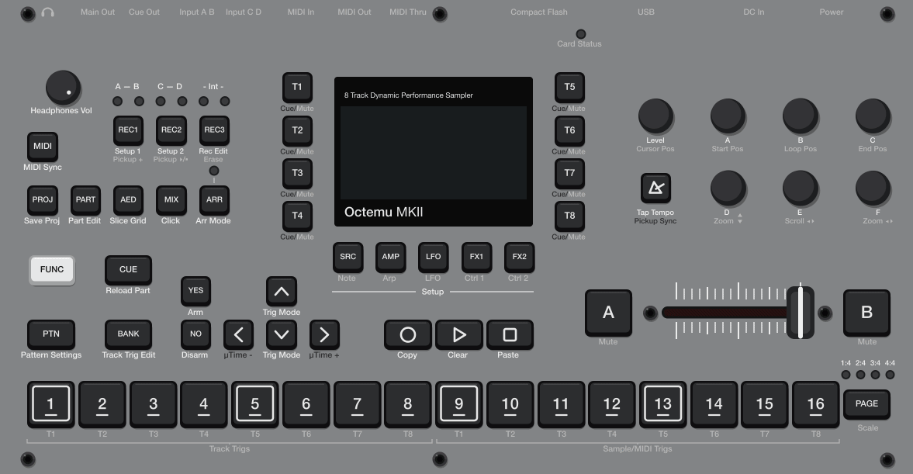
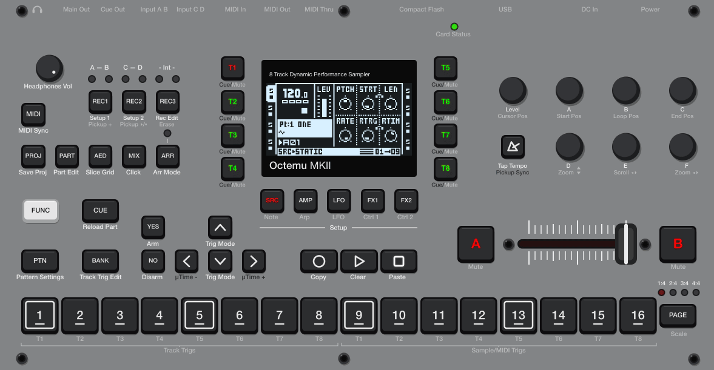

# octemu

**octemu** is an Octatrack emulator for macOS, built around [QEMU][QEMU]
(ColdFire MCF54455), [dsp56300][dsp56300], and [SDL2][SDL2] with the goal of
providing a development environment for firmware customizations, including MIDI
and audio over USB.



## `octemu` & `octdsp`

### Build

```sh
make doctor   # what your computer is missing, with the formula for each
make setup    # vendor toolchain: dsp56300, elektron-firmware-tool
make os       # fetch + unpack YOUR copy of the OS -> out/os/main.bin
make qemu     # the patched QEMU (~10-15 min)
make          # both programs, the panel raster, a blank CF card
```

`make setup` and `make qemu` clone their dependencies into `vendor/`, which
ends up around 1.2 GB.

### Run

```sh
./octemu                                                  # the Octatrack, windowed
./octdsp --in-a sin:440 --out-main out/x.wav --timeout 2  # its DSP cores, no QEMU
```

`octemu` boots from the CF card image `make` leaves in `out/state/`, and writes
its battery file alongside on the first run.

**Known issues**

The playback warbles. I think this can be fixed by buffering.

### Demo

This will create a CF card with a simple set and project, where track 1 is
configured with a STATIC machine and a sine wave assigned to its first slot:

```sh
make fixtures
cp -R out/fx2 out/play
./octemu --cf-card out/play/card.img --nvram out/play/nvram.bin
```

Work on the copy: `out/fx2` is a cached fixture tests start from, and anything
you save in the emulator writes straight back into it. Delete `out/fx2` to
rebuild it.

## Firmware customizations

Customizations are applied to a stock Elektron-supplied firmware image you
provide, using [elektron-firmware-tool][elektron-firmware-tool].

> [!CAUTION]
> I take no responsibility for any damage to your Octatrack, data loss to your
> CF card, etc., from attempting to use these firmware customizations. Be
> careful.

### RECEIVE machine

This is a generalization of the NEIGHBOR machine. Instead of only receiving the
preceding track as input, you can choose up to 6 tracks to receive as input,
p-lock how much each track contributes to the mix, and place trigs.

**You can create feedback loops this way.** Be careful.

The RECEIVE machine, like the NEIGHBOR machine it replaces, introduces a
16-sample delay.

```sh
make fw-receive
./octemu --os out/OCTATRACK_OS1.40C_receive_<build>.os
```



### USB-MIDI

Reverse-engineering revealed partial support for USB-MIDI already implemented in
the Octatrack firmware. This customization completes it. I've done some basic
validation, and it seems to work. It is a mirror of the DIN ports.

```sh
make fw-usb-midi
./octemu --os out/OCTATRACK_OS1.40C_usb-midi_<build>.os --midi
```

### USB-Audio

Adds a UAC2 interface: at high speed the Octatrack appears as a 16-channel
44.1 kHz 16-bit USB audio input — the eight tracks, each as a stereo pair
(track 1 on channels 1/2 … track 8 on 15/16), tapped post-FX and pre-fader. At
full speed it falls back to the stereo sum of the tracks. The source is the
per-track post-FX buffers the DSP returns to the CPU.

```sh
make fw-usb-audio
```

This one does not fit in the firmware image, so a unit needs both halves: the
flashed image, and a payload on the CF card root under that exact name.

```sh
cp out/USBAUDIO.BIN /Volumes/OCTATRACK/
```

If you have problems, you can recover by

- holding "NO" at boot (skips loading `USBAUDIO.BIN`).
- deleting `USBAUDIO.BIN` from the CF card.

**Test fixture**

`out/sig8` is a test set where each of the eight tracks plays a distinct
stereo tone on a one-shot trig — track 1 at 250/300 Hz through track 8 at
950/1000 Hz — so every one of the sixteen USB channels carries a unique
frequency and both the track-to-channel mapping and left/right can be checked
by ear or by measurement.

```sh
tests/build-sig-fixture.sh    # generates the samples and the set (~12 min)
```

`make test-emu-usb-audio-stream16` builds it if needed and runs the 16-channel
gate on it: every USB channel must carry its own frequency, and every channel
pair must equal its track's post-FX readback sample-exact.

Boot it and press PLAY to hear the eight tones:

```sh
./octemu --cf-card out/sig8/card.img --nvram out/sig8/nvram.bin
```

`tests/usb-audio-sigcheck.py --pcm capture.pcm` confirms each channel carries
its expected frequency from a 16-channel capture.

**Known issues**

- You may have to re-plug the USB cable.
- Only tested on macOS with `sox`, not in a DAW.
- Some crackles may be audible.

## Licensing & legal

Elektron, Octatrack and Octatrack MKII are trademarks of Elektron Music
Machines MAV AB. This project is unaffiliated with and unendorsed by them.
**Nothing Elektron-owned is in this repository.**

The `octemu` and `octdsp` binaries combine sources under incompatible licenses.
You can build them on your own computer and use them, but **you may not
distribute them.** This project's own sources are MIT-licensed.

See [LICENSE.md][LICENSE] for more details.

## Acknowledgements

Shoutout to the following projects:

- **[mxldyn/octamax][octamax]** and **[sambanks/octabam][octabam]**: the
  projects that inspired this one and did the first reverse-engineering passes
  (that I am aware of) on the Octatrack.
- **[mischa85/elektron-firmware-tool][elektron-firmware-tool]**: used for
  modifying Octatrack firmware images.
- **[The Usual Suspects][theusualsuspects]**: creators of the
  [dsp56300][dsp56300] library used for emulating the Octatrack's DSP cores.

This project was built essentially entirely with Claude Code. I have de-slopped
it where I could.

[QEMU]: https://www.qemu.org
[dsp56300]: https://github.com/dsp56300/dsp56300
[SDL2]: https://www.libsdl.org
[LICENSE]: LICENSE.md
[octamax]: https://github.com/mxldyn/octamax
[octabam]: https://github.com/sambanks/octabam
[theusualsuspects]: https://theusualsuspects.io
[elektron-firmware-tool]: https://github.com/mischa85/elektron-firmware-tool
